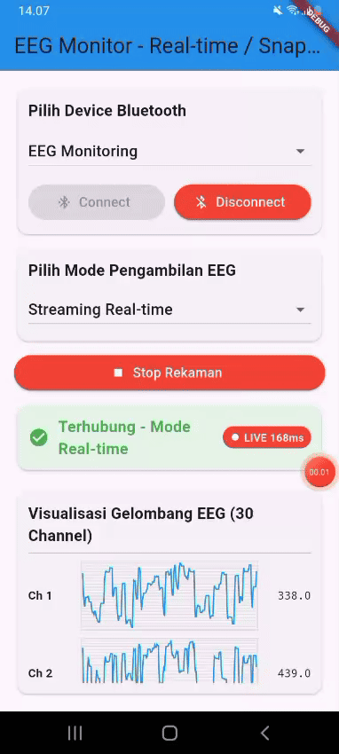

# portable-eeg
A portable EEG system with 30 channels enables real-time brain signal acquisition without the constraints of traditional wired laboratory setups. The EEG cap streams high-resolution neural data directly to a smartphone either Android or iOS where signals can be visualized live through a dedicated mobile application. All recordings are automatically stored on the device for local access and can be securely synchronized to a cloud server for long-term storage, analysis, and AI-driven processing. This seamless pipeline allows continuous monitoring, remote data management, and efficient integration with advanced analytics, making the system highly suitable for clinical, research, and real-world applications.

## Arsitektur

  

